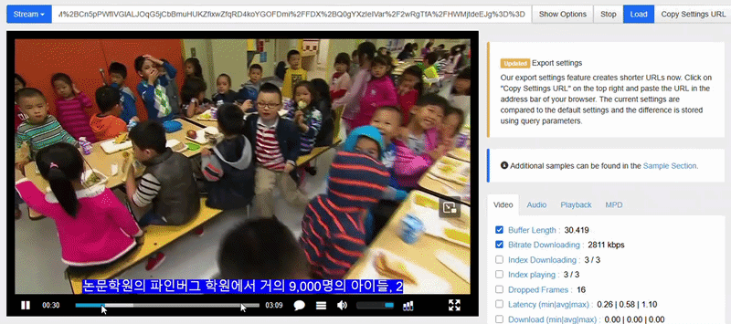
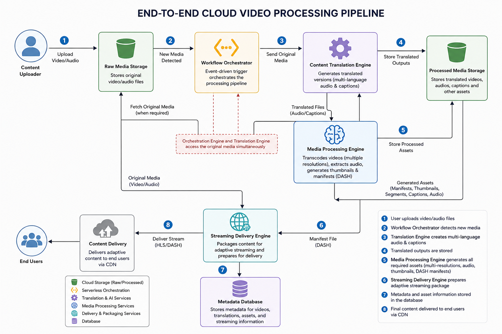

<div align="center">

# Cloud Video Processing Pipeline

### Event-Driven Cloud-Native Media Processing on Google Cloud Platform

Automated video ingestion, multi-resolution transcoding, multilingual caption generation, adaptive streaming, and media asset creation using Google Cloud managed services.

[]()
[]()
[]()
[]()
[]()
[]()
[]()
[]()
[]()
[]()
[]()

</div>

---

## 🎬 Live Demonstration

<p align="center">
  
</p>

---
# Metric
<div align="center">

| Metric | Value |
|--------|------:|
| Video Profiles | 3 (SD, HD, UHD) |
| Subtitle Languages | 6 |
| Generated Assets | 12+ |
| Architecture | Event-Driven |
| Cloud Services | 8+ |
| Deployment | Serverless |

</div>

---
# Overview

Cloud Video Processing Pipeline is an event-driven cloud-native platform that automates the complete lifecycle of video processing on Google Cloud Platform.

The pipeline transforms uploaded videos into streaming-ready media assets by orchestrating multiple managed cloud services responsible for transcoding, audio extraction, subtitle generation, thumbnail creation, and adaptive streaming preparation.

The architecture is designed around serverless principles, allowing independent processing jobs, automatic scaling, and high availability while minimizing operational overhead.

---

# Key Features

- Automated video ingestion using Cloud Storage events

- Event-driven orchestration with Cloud Functions

- Multi-resolution transcoding (SD, HD, UHD)

- Audio extraction pipeline

- Multilingual subtitle generation

- Automatic thumbnail creation

- DASH adaptive streaming asset generation

- Cloud-native serverless architecture

- Independent processing workflows

- Horizontally scalable media processing

---

# Generated Media Assets

Each uploaded video automatically generates:

## Video

- SD (480p)

- HD (720p)

- UHD (1080p)

---

## Audio

- Audio-only output

---

## Captions

- English

- French

- Spanish

- Japanese

- Mandarin Chinese

- Korean

---

## Streaming

- DASH Manifest (.mpd)

- Streaming Segments

---

## Images

- Thumbnail Preview

---

# Architecture

<p align="center">
  
</p>

The platform follows an event-driven architecture where each uploaded media file creates an independent processing workflow.

Google Cloud managed services orchestrate every processing stage, enabling scalable media transformation while maintaining loose coupling between components.

The processing workflow includes:

1. Video Upload

2. Event Detection

3. Processing Orchestration

4. Video Transcoding

5. Audio Extraction

6. Speech Recognition

7. Multilingual Caption Generation

8. Thumbnail Creation

9. DASH Manifest Generation

10. Storage of Streaming Assets

---

# Why This Project?

Modern streaming platforms require significantly more than simple video uploads.

This project demonstrates how cloud-native technologies can automate an entire media processing pipeline capable of producing production-ready assets including:

- Adaptive bitrate video

- Speech captions

- Audio-only outputs

- Streaming manifests

- Thumbnail generation

---

# End-to-End Workflow

The pipeline processes every uploaded video through an automated cloud workflow.


- Cloud-native scalability

The architecture emphasizes reliability, modularity, and automation while leveraging managed Google Cloud services to reduce infrastructure management.


---

# Processing Pipeline

## 1. Video Ingestion

A user uploads a source video into Google Cloud Storage.

The upload event automatically triggers the processing workflow.

Responsibilities:

- Receive original media files
- Detect new uploads
- Extract file metadata
- Initialize processing jobs

---

## 2. Event-Driven Processing

Cloud Storage events are captured through Google Cloud event services.

The workflow automatically starts without manual intervention.

Benefits:

- Asynchronous execution
- Independent processing jobs
- Automatic scaling
- Fault isolation

---

## 3. Video Transcoding

Google Cloud Transcoder API generates multiple video profiles from the original source.

Generated formats:

| Profile | Resolution | Purpose |
|---------|------------|---------|
| SD | 480p | Low bandwidth playback |
| HD | 720p | Standard quality streaming |
| UHD | 1080p | High quality playback |

Multiple quality levels enable adaptive streaming based on network conditions.

---

## 4. Audio Processing

The pipeline extracts the audio stream from processed videos.

Audio processing includes:

- Audio extraction
- Format conversion
- Speech recognition preparation

The generated audio asset is used for automatic caption generation.

---

## 5. Multilingual Caption Generation

Speech-to-Text services convert audio content into text.

The pipeline generates subtitle tracks supporting multiple languages: 
English
French
Spanish
Japanese
Mandarin Chinese
Korean

Captions are generated in WebVTT format for compatibility with modern streaming players.

---

## 6. Thumbnail Generation

FFmpeg generates representative thumbnails from processed videos.

Generated thumbnails are used for:

- Video previews
- Media catalogs
- Content management systems
- Streaming interfaces

---

## 7. Adaptive Streaming Preparation

The pipeline generates streaming-ready assets.

Generated outputs include:

- DASH manifest files (.mpd)
- Video segments
- Audio tracks
- Caption tracks

These assets enable adaptive bitrate streaming across different devices and network conditions.

---

# Technical Stack

## Programming Languages

- Python
- Bash

---

## Backend Development

- FastAPI
- REST APIs
- Asynchronous Processing
- Microservices Architecture

---

## Google Cloud Platform

- Cloud Storage
- Cloud Functions
- Cloud Run
- Pub/Sub
- Eventarc
- Transcoder API
- Speech-to-Text API
- Cloud Logging
- Cloud Monitoring

---

## Media Processing

- FFmpeg
- MPEG-DASH
- WebVTT Captions
- Audio Processing Pipelines

---

## Containers & DevOps

- Docker
- Kubernetes
- Git
- CI/CD Pipelines
- Linux Environments

---

# Repository Structure

```text
cloud-video-processing-pipeline/
│
├── assets/
│   ├── cloud-video-processing.gif
│   └── cloud-video-architecture.png
│
├── docs/
│   ├── architecture.md
│   ├── deployment.md
│   └── workflow.md
│
├── src/
│
├── Dockerfile
├── requirements.txt
├── README.md
└── LICENSE
```

---

# Cloud Services Responsibilities

| Component | Responsibility |
|-----------|---------------|
| Cloud Storage | Media ingestion and asset storage |
| Cloud Functions | Workflow orchestration |
| Transcoder API | Video encoding and packaging |
| Pub/Sub | Event communication |
| Eventarc | Event routing |
| Cloud Run | Containerized processing services |
| Speech-to-Text | Caption generation |
| FFmpeg | Media manipulation |

---

# Generated Output Example

After processing a video, the system produces:
```text
processed-video/
│
└── sample-video/
    │
    ├── video/
    │   ├── SD.mp4
    │   ├── HD.mp4
    │   └── UHD.mp4
    │
    ├── audio/
    │   └── audio-output.ogg
    │
    ├── subtitles/
    │   ├── en.vtt
    │   ├── fr.vtt
    │   ├── es.vtt
    │   ├── ja.vtt
    │   ├── zh.vtt
    │   └── ko.vtt
    │
    ├── thumbnail.jpg
    │
    └── manifest.mpd
```

---

# Engineering Principles

The system was designed following cloud-native engineering principles:

- Event-driven architecture
- Separation of responsibilities
- Stateless processing
- Managed cloud services
- Horizontal scalability
- Automated workflows
- Fault isolation

---

# Deployment

The platform is designed to run entirely on managed Google Cloud services.

## Deployment Workflow

1. Upload source code
2. Build container image
3. Deploy Cloud Run services
4. Deploy Cloud Functions
5. Configure Cloud Storage buckets
6. Configure Eventarc triggers
7. Configure Pub/Sub messaging
8. Enable required Google Cloud APIs
9. Upload a video to start processing

---

# Documentation

Additional technical documentation is available in the **docs/** directory.

| Document | Description |
|----------|-------------|
| docs/architecture.md | System architecture and cloud components |
| docs/deployment.md | Deployment guide |
| docs/workflow.md | End-to-end processing workflow |

---

# Engineering Challenges

This project focused on solving several cloud engineering challenges.

## Event-Driven Orchestration

Designed a fully automated workflow where every uploaded video triggers an independent processing pipeline.

---

## Distributed Media Processing

Coordinated multiple cloud services responsible for transcanning, audio extraction, caption generation, and media packaging.

---

## Adaptive Streaming

Generated streaming-ready assets including:

- SD
- HD
- UHD
- DASH Manifest
- Caption Tracks
- Audio Streams

---

## Serverless Automation

Reduced operational complexity by leveraging managed cloud services instead of dedicated virtual machines.

---

# Project Highlights

✅ Cloud-native architecture

✅ Event-driven workflows

✅ Fully automated media processing

✅ Multi-resolution transcoding

✅ Six-language caption generation

✅ Adaptive streaming support

✅ Automatic thumbnail generation

✅ Serverless deployment

---

# Skills Demonstrated

This project demonstrates experience with:

- Cloud Architecture
- Backend Engineering
- Distributed Systems
- Event-Driven Design
- Media Processing
- REST APIs
- Python Development
- Docker Containers
- Google Cloud Platform
- Serverless Computing
- Cloud Automation
- Microservices
- Streaming Technologies

---

# Future Improvements

Potential future enhancements include:

- HLS adaptive streaming support

- AI-powered scene detection

- Automatic language detection

- Video summarization using LLMs

- OCR for embedded text

- Content moderation

- DRM packaging

- Multi-region deployments

- Infrastructure as Code (Terraform)

- CI/CD with Cloud Build

---

# Learning Outcomes

Building this project provided practical experience with:

- Designing event-driven architectures

- Developing cloud-native applications

- Orchestrating distributed processing pipelines

- Working with managed Google Cloud services

- Building scalable backend systems

- Automating media workflows

- Optimizing cloud deployments

---

# Repository Status

| Component | Status |
|----------|:------:|
| Video Upload | ✅ |
| Event Processing | ✅ |
| Cloud Functions | ✅ |
| Video Transcoding | ✅ |
| Audio Extraction | ✅ |
| Caption Generation | ✅ |
| Thumbnail Generation | ✅ |
| DASH Packaging | ✅ |
| Documentation | ✅ |

---

# License

This project is released under the **MIT License**.

See the LICENSE file for additional details.

---

# Author

**Arielle Sedoine Mogoung Notouom**

Cloud Software Engineer

- **Email:** notouom777@gmail.com
- **LinkedIn:** https://www.linkedin.com/in/arielle-60178832a/
- **Website:** https://arielle-sedoineapp-vosyn2.vercel.app/

---

<div align="center">

### ⭐ If you found this project interesting, consider giving it a star!

Thank you for visiting this repository.

</div>
